# CVDS - LABORATORIO 2 - PATTERNS

Angie Natalia Mojica Diaz\
Daniel Antonio Santanilla Arias

## SOBRE APACHE MAVEN

### ¿Cuál es su mayor utilidad?

### Fases de maven

### Ciclo de vida de la construcción

### Para qué sirven los plugins

### ¿Qué es y para qué sirve el repositorio central de maven?

## EJERCICIO DE LAS FIGURAS

### CREAR UNPROYECTO CON MAVEN

Buscarcómo se crea un proyecto maven con ayuda de los arquetipos(archetypes).
Busque cómo ejecutar desde línea de comandos el objetivo "generate" del plugin "archetype",con los siguientes
parámetros:\
Grupo: edu.eci.cvds\
Id del Artefacto: Patterns\
Paquete: edu.eci.cvds.patterns\
archetypeArtifactId: maven-archetype-quickstart

```console
mvn archetype:generate
```

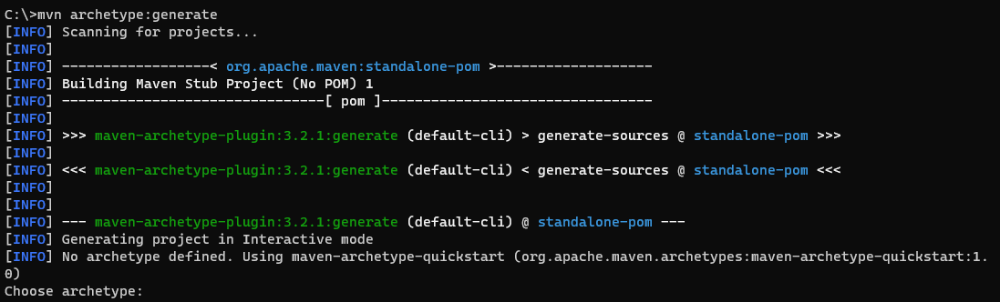
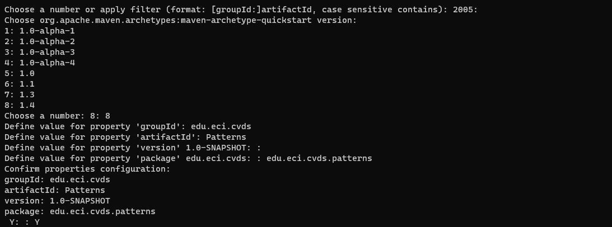
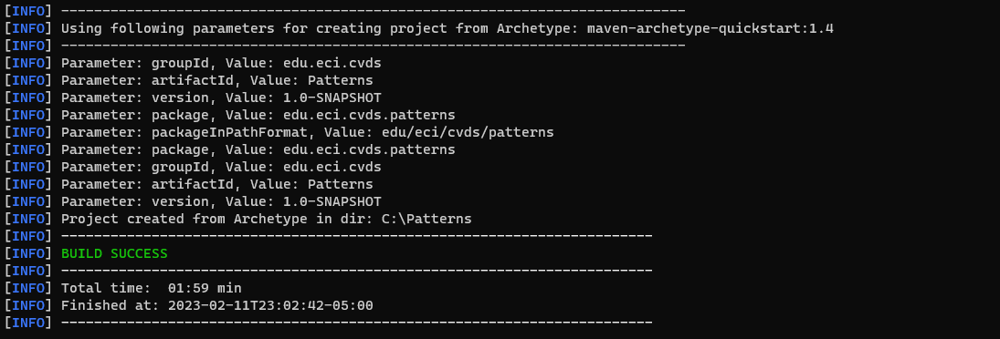
Para visualizar la estructura hacemos los comandos

```console
cd Patterns
tree /f
```

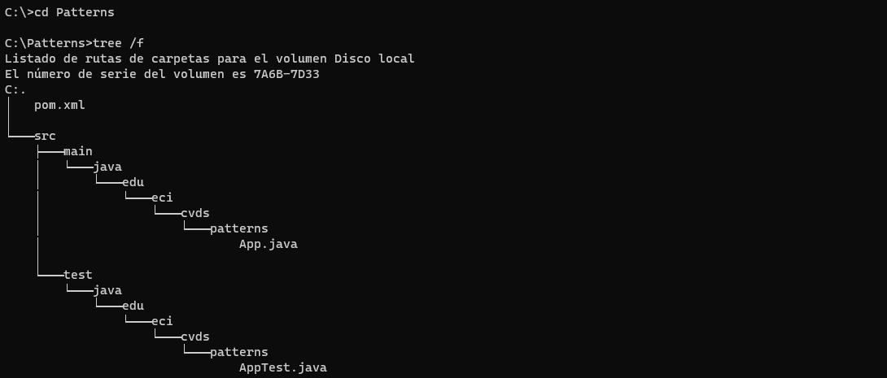

### AJUSTAR ALGUNAS CONFIGURACIONES EN EL PROYECTO

Hay que cambiar la version delcompilador de Java a la versión 8, para ello, agregue la sección properties antes de la sección de
dependencias:\
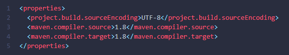

### COMPILAR Y EJECUTAR

Para compilar usar el comando

```console
mvn package
```

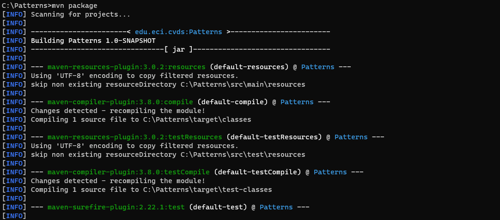
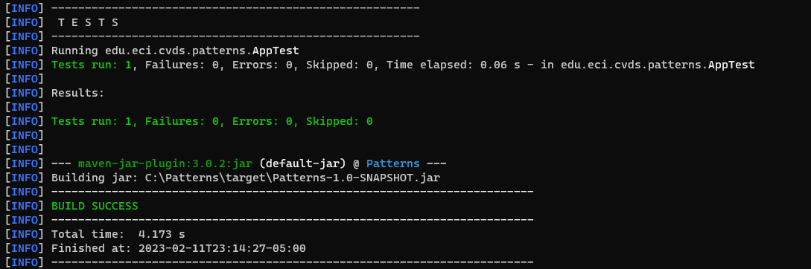

#### Objetivo del parametro package

Para ejecutar usar el comando

```console
mvn exec:java -Dexec.mainClass="edu.eci.cvds.patterns.App"
```

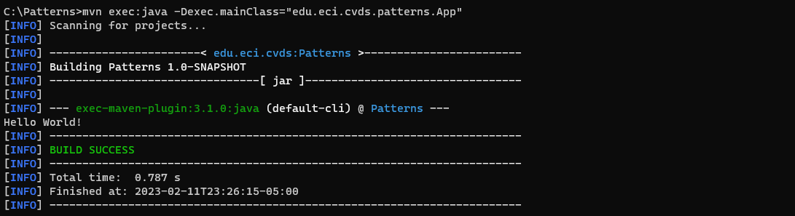
Realice elcambio en la clase App.java para crear un saludo personalizado, basado en los parámetros de entrada a la aplicación.
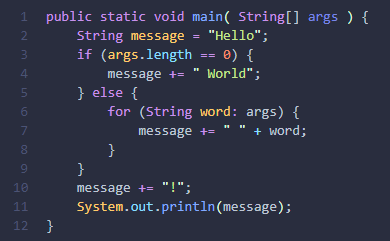

Para mandar parametros al plugin "exec" se da de la siguiente manera

```console
mvn exec:java -Dexec.mainClass="edu.eci.cvds.patterns.App" -Dexec.args="'argument1' 'argument2'"
```

Ejecutar nuevamente la clase desde línea de comandos y verificar la salida: Hello World!

Ejecutar la clase desde línea de comandos enviando su nombre como parámetro y verificar la salida. Ej: Hello Pepito!
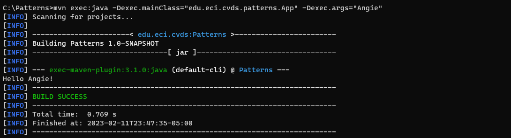
Ejecutar la clase con su nombre y apellido como parámetro.¿Qué sucedió?
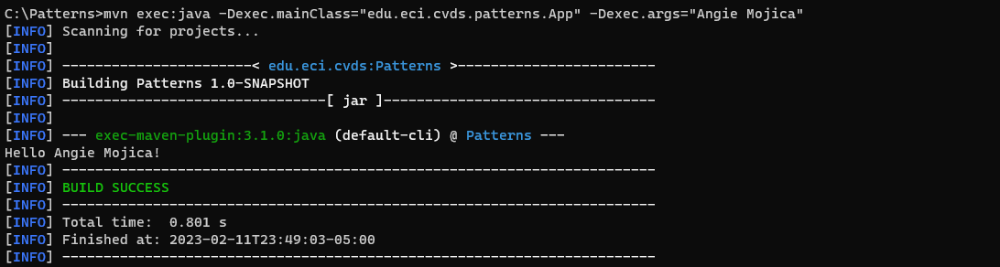
Verifique cómo enviar los parámetros de forma "compuesta" para que elsaludo se realice con nombre y apellido. Ejecutar nuevamente y verificar la salida en consola. Ej: Hello Pepito Perez!
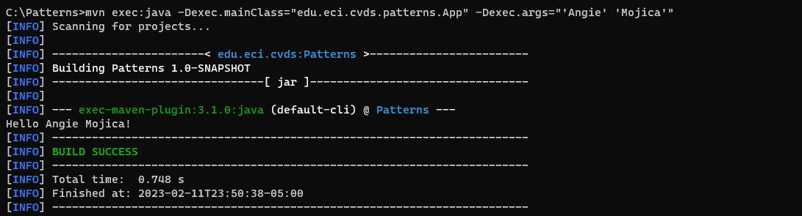

### HACER EL ESQUELETO DE LA APLICACION

Hacer el esqueleto de la aplicacion de acuerdo a la guia de laboratorio.
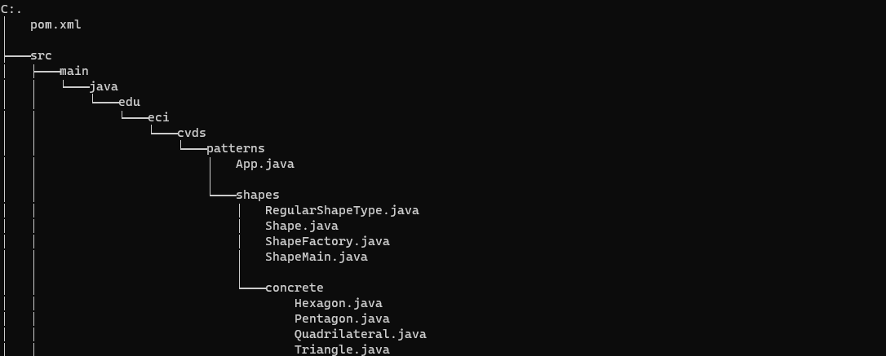
Ejecute múltiples veces la clase ShapeMain, usando el plugin exec de maven con los siguientes parámetros y verifique la salida en consola para cada una:\
Sin parámetros
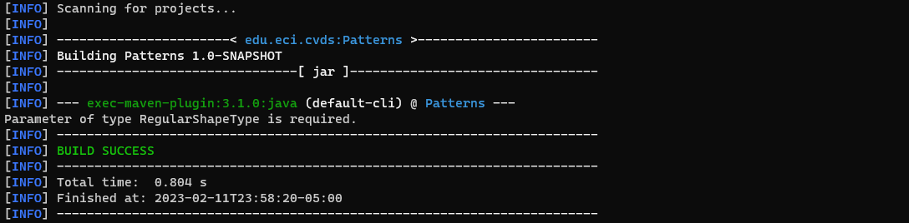
Parámetro: qwerty
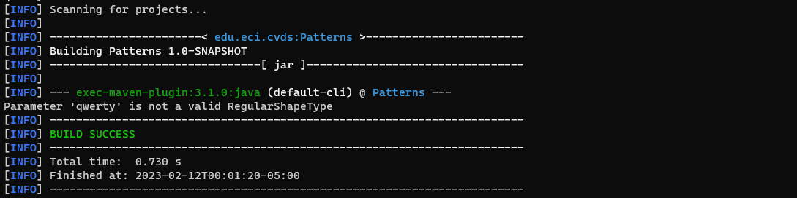
Parámetro: pentagon
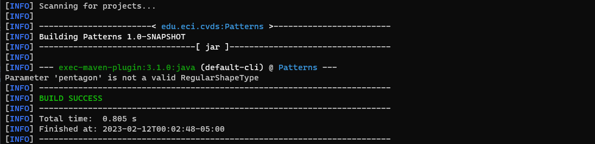
Parámetro: Hexagon
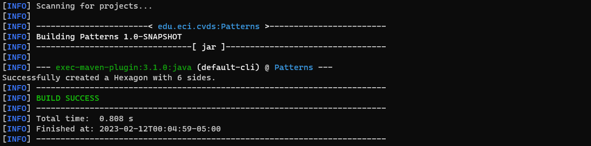

#### ¿Cuál(es) de las anterioresinstruccionesse ejecutan y funcionan correctamente y por qué?
